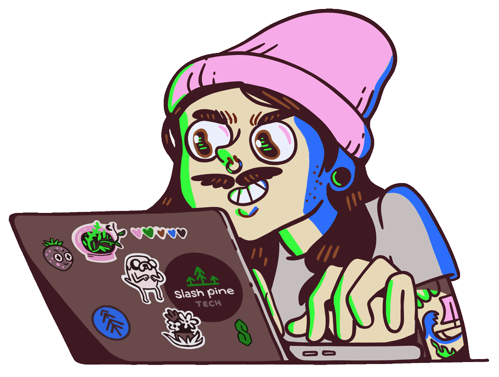
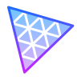
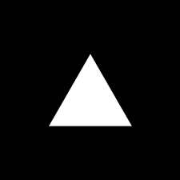

<!-- 

  

 -->
<h1 align="center">Hi👋,  I am <b>Rakshit Raj</b></h1>

  

<h1 align="center"> About Me</h1>

I am a FrontEnd Developer and Machine Learning Enthusiast with a huge love for Python, JavaScript, React.js, Java. 

 
- ✨ Student @VIT Bhopal...
- 🌱 I’m currently Learning Web Development and Machine Learning.
- 🏙  Top Project till Macbook_Clone
- ✍ Currently Working on my Portfolio
- ❤ Contributing to Open Source.
<!--Profile Count Badge-->

  

<h2 align="center"> Cᴏɴɴᴇᴄᴛ Wɪᴛʜ Mᴇ 🤝 </h2>

  

 

<h1 align="center"> Tech Stack</h1>
<h3>Core Languages</h3>

  

   
  <h3>Frameworks</h3>
  
  
  
  
 

  <h3>Tools and Softwares</h3>
  
  
  
  
  
  
  
  
  <!--  -->
  

  <h3>Deployment Tools</h3>
  
  

<!--           -->

  

<h2 align="center"> Gɪᴛʜᴜʙ Tʀᴏᴘʜɪᴇs </h2>

  <a href="https://github.com/rakshitrajvit">
    <picture>
      <source media="(prefers-color-scheme: dark)" srcset="https://github-profile-trophy-ruddy.vercel.app/?username=rakshitrajvit&no-bg=true&row=2&column=6&margin-w=20&margin-h=20&theme=monokai">
      <source media="(prefers-color-scheme: light)" srcset="https://github-profile-trophy-ruddy.vercel.app/?username=rakshitrajvit&no-bg=true&row=2&column=6&margin-w=20&margin-h=20">
      
    </picture>
  </a>

<h2 align="center"> Gɪᴛʜᴜʙ Sᴛᴀᴛs </h2>

<table width="100%">
  <tr>
    <td width="50%">
      <h3 align="center"><strong>Gɪᴛʜᴜʙ Sᴛᴀᴛs</strong></h3>
      

        
      

    </td>
    <td width="50%">
      <h3 align="center"><strong>Sᴛʀᴇᴀᴋ Sᴛᴀᴛs</strong></h3>
      

        
      

    </td>
  </tr>
  <tr>
    <td width="50%">
      <h3 align="center"><strong>Lᴀᴛᴇsᴛ Pʀᴏᴊᴇᴄᴛ</strong></h3>
      

        
      

    </td>
    <td width="50%">
      <h3 align="center"><strong>Tᴏᴘ Cᴏɴᴛʀɪʙᴜᴛɪᴏɴs</strong></h3>
      

        
      

    </td>
  </tr>
</table>
 

  

